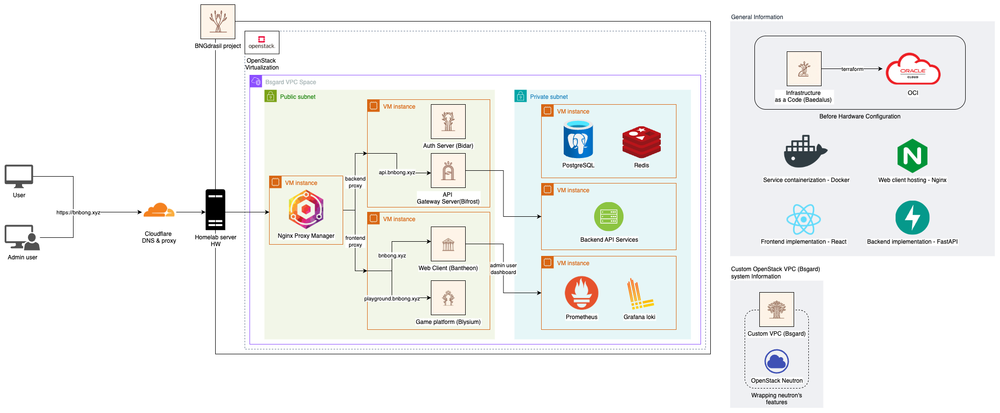
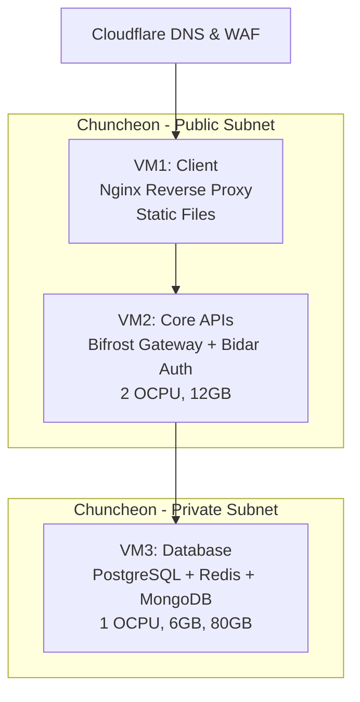
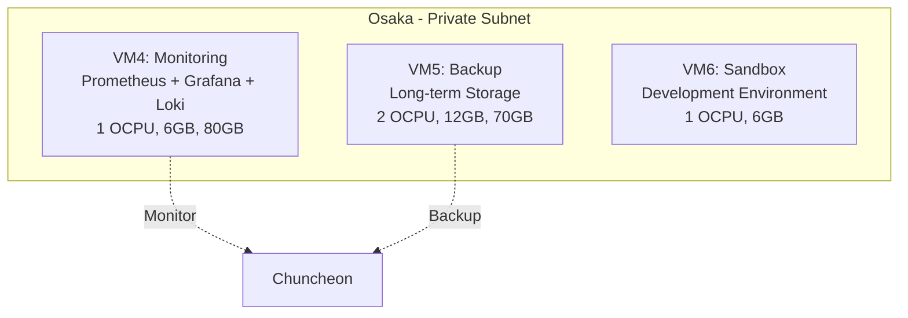

    

# BNGdrasil (BNbong + ygGdrasil)

**A comprehensive cloud infrastructure project**

*A personal cloud nation infrastructure project by [bnbong](https://github.com/bnbong) - A comprehensive cloud infrastructure project*

---

## Overview

BNGdrasil is a comprehensive cloud ecosystem that integrates a personal portfolio, API services, authentication systems, and infrastructure automation. All infrastructure is managed through **Infrastructure as Code (IaC)** principles, designed to operate seamlessly across global cloud environments (Oracle Cloud, AWS, Azure) and future home lab (OpenStack-based) environments.

## Project Naming Convention

Each sub-project in BNGdrasil combines **bnbong's name + Norse mythology/concepts**:

- **BNGdrasil (Main Project)**: The overarching project name (bnbong + Yggdrasil, the World Tree)

### Sub-projects

1. **🏗️ [Baedalus (IaC)](https://github.com/BNGdrasil/Baedalus)**
   - Terraform-based infrastructure code project
   - Declarative management of CSP environments (Oracle Cloud, etc.) and home lab (OpenStack) infrastructure
   - (bnbong + Daedalus, architect and craftsman of Greek mythology)

2. **🌐 [Bsgard (Custom VPC)](https://github.com/BNGdrasil/Bsgard)**
   - Custom network project wrapping OpenStack Neutron functionality
   - Provides VPC-like features for CSP environments
   - Manages VM resource placement in home lab environment with Public/Private Subnet architecture
   - (bnbong + Asgard, gods' location in Nordic mythology)

3. **🌉 [Bifrost (API Gateway)](https://github.com/BNGdrasil/Bifrost)**
   - FastAPI-based API Gateway service
   - API service routing, logging, authentication/authorization (JWT, API Key)
   - Admin UI integration for service registration and management
   - (bnbong + Bifrost, bridge between the gods and humans in Norse mythology)

4. **🔐 [Bidar (Auth Server)](https://github.com/BNGdrasil/Bidar)**
   - FastAPI-based authentication server
   - JWT-based authentication/authorization, Superuser management
   - PostgreSQL/Redis integration for user and session management
   - (bnbong + Vidar, god of vengeance and guardian of silence)

5. **🎨 [Bantheon (Web Client + Portfolio)](https://github.com/BNGdrasil/Bantheon)**
   - React-based static frontend
   - Portfolio pages and Admin Client functionality
   - Integration with API Gateway and Auth Server for administrative operations
   - (bnbong + Pantheon, temple of the gods from ancient Greek)

## Architecture

### Multi-Region Architecture

**Chuncheon Region (Main Services):**

**Osaka Region (Monitoring & Backup):**

**Cross-Region Communication:**
- VCN Remote Peering Connection (RPC) between Chuncheon and Osaka
- Zero data transfer costs (within same OCI tenancy)
- Main services in Chuncheon minimize cross-region traffic

## Technology Stack

- **Backend (API Gateway, Auth Server)**: Python 3.12+ (FastAPI)
- **Frontend (Portfolio, Admin UI)**: React (Vite-based)
- **Infrastructure as Code**: Terraform
- **Containerization**: Docker, Docker Compose (→ Kubernetes scalable)
- **Database & Cache**: PostgreSQL, Redis
- **Monitoring**: Prometheus, Grafana, Loki
- **DNS & Proxy**: Cloudflare + Nginx Proxy Manager
- **Cloud / Virtualization**: Oracle Cloud → OpenStack (Home Lab)

## Security & Access Control

- **Public Services Protection**: Cloudflare DNS & Proxy + WAF
- **Private Subnet Isolation**: External access restricted (VPN/Bastion Host only)
- **Service Deployment**: Docker Compose-based VM deployment (Kubernetes expansion planned)

## Development Roadmap

### Phase 1: Core Infrastructure ✅
- [x] Project structure design
- [x] Docker Compose configuration
- [x] Terraform infrastructure code
- [x] API Gateway implementation
- [x] Auth Server implementation

### Phase 2: Frontend Development
- [ ] React client implementation
- [ ] Portfolio website
- [ ] Admin panel

### Phase 3: Advanced Features
- [ ] Monitoring system
- [ ] CI/CD pipeline
- [ ] Backup system
- [ ] Performance optimization

## Future Expansion Plans

- **API Gateway (Bifrost)**: Service registration automation, API Key issuance, Rate Limiting
- **Auth Server (Bidar)**: OIDC integration, Role-based access control
- **Bantheon**: Project showcase additions, admin dashboard expansion
- **Baedalus**: Multi-CSP support (easy migration to AWS, Azure)
- **Bsgard**: OpenStack Neutron-based API wrapper completion for CSP-like VPC functionality

---

*BNGdrasil - Building a personal cloud nation, one service at a time.*
