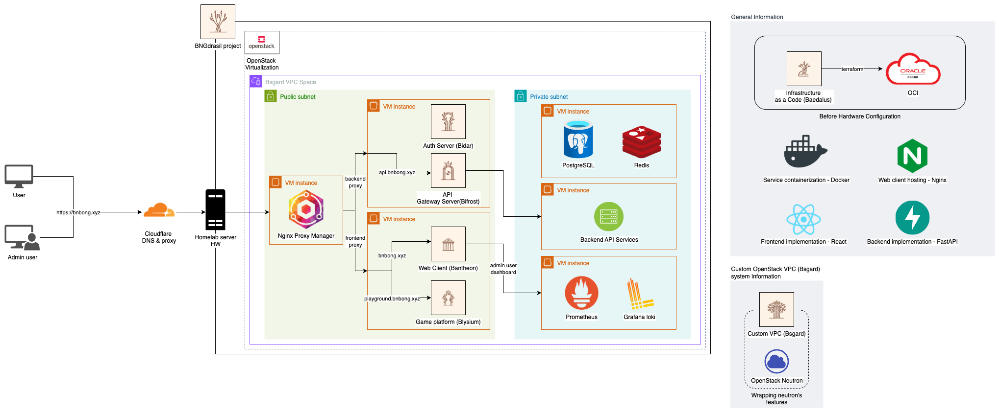
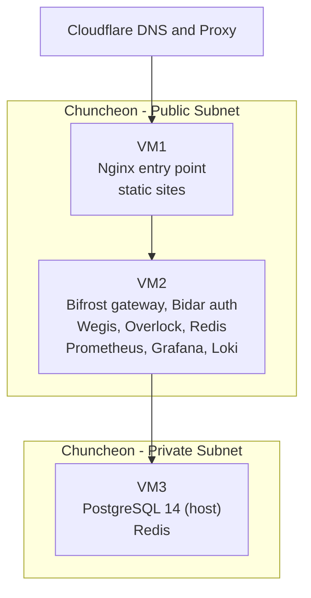

    

# BNGdrasil (BNbong + ygGdrasil)

**A personal cloud infrastructure project**

*A personal cloud infrastructure project by [bnbong](https://github.com/bnbong)*

---

## Overview

BNGdrasil is a personal cloud ecosystem that brings together a portfolio site, an API gateway, an authentication server, and the infrastructure code that provisions them. Infrastructure is described with Terraform and the services run as Docker Compose stacks on Oracle Cloud VMs in the Chuncheon region.

The project is actively operated, and parts of it are still being built. Where a component is planned rather than running, this page says so.

## Project Naming Convention

Each sub-project combines **bnbong's name with a figure or place from Norse and Greek mythology**. The umbrella name comes from Yggdrasil, the World Tree.

### Sub-projects

1. **[Baedalus (Infrastructure as Code)](https://github.com/BNGdrasil/Baedalus)**
   - Terraform code for the Oracle Cloud tenancy: networks, instances, bootstrap scripts, and the deployment and backup tooling that runs against them.
   - Also holds the deployment baseline that records what is actually running on each VM.
   - (bnbong + Daedalus, the craftsman of Greek mythology)

2. **[Bifrost (API Gateway)](https://github.com/BNGdrasil/Bifrost)**
   - FastAPI service that routes requests to registered backend services and exposes the admin API used by the dashboard.
   - The service registry lives in PostgreSQL. Administrative permissions are verified against Bidar.
   - (bnbong + Bifröst, the bridge between gods and humans in Norse mythology)

3. **[Bidar (Auth Server)](https://github.com/BNGdrasil/Bidar)**
   - FastAPI authentication server issuing JWT access tokens, with role based access control and PostgreSQL backed user storage.
   - API key models exist in the schema, but issuing, verifying, and revoking keys is not finished, so API keys are not a protection mechanism yet.
   - (bnbong + Víðarr, god of vengeance and silence)

4. **[Bantheon (Web Client and Admin Panel)](https://github.com/BNGdrasil/Bantheon)**
   - React and Vite frontend: the public portfolio site, the admin dashboard, and the Nginx configuration that serves both.
   - (bnbong + Pantheon, the temple of all gods)

5. **[Bsgard (Custom VPC)](https://github.com/BNGdrasil/Bsgard)** (*planned, not started*)
   - An intended wrapper around OpenStack Neutron that would provide VPC-like networking for a future home lab.
   - The repository is currently empty. Work on it is deferred until there is a real home lab requirement.
   - (bnbong + Asgard, the realm of the gods)

## Architecture

> The diagram above shows the original design. The deployment described below is the current one, and the two differ in several places.

### Current deployment (Chuncheon region)

```mermaid
graph TB
    CF[Cloudflare DNS and Proxy]

    subgraph Public["Chuncheon - Public Subnet"]
        VM1["VM1<br/>Nginx entry point<br/>static sites"]
        VM2["VM2<br/>Bifrost gateway, Bidar auth<br/>Wegis, Overlock, Redis<br/>Prometheus, Grafana, Loki"]
    end

    subgraph Private["Chuncheon - Private Subnet"]
        VM3["VM3<br/>PostgreSQL 14 (host)<br/>Redis"]
    end

    CF --> VM1
    VM1 --> VM2
    VM2 --> VM3
```

- **VM1** terminates every web domain and serves the built static releases.
- **VM2** runs the gateway, the auth server, two separately owned services (Wegis and Overlock), and the observability stack. Monitoring was originally planned for a second region but it runs here.
- **VM3** holds the single production database, PostgreSQL 14 installed on the host rather than in a container. An upgrade is planned before upstream support for this major version ends.

### Osaka region

A second region was provisioned in the original design for monitoring and backup. It is no longer part of the running system:

- **VM4** exists but is unconfigured. It is a spare, not a replica and not a disaster recovery target.
- **VM5 and VM6** were retired and their resources reassigned.

Off-site backup storage is planned but has not been set up yet.

## Technology Stack

- **Backend**: Python 3.12+ with FastAPI, packaged and locked with uv
- **Frontend**: React with Vite and TypeScript
- **Infrastructure as Code**: Terraform on Oracle Cloud Infrastructure
- **Containers**: Docker and Docker Compose
- **Data**: PostgreSQL and Redis
- **Observability**: Prometheus, Grafana, and Loki
- **Edge**: Cloudflare DNS and proxy in front of Nginx

## Security and Access Control

- Public traffic passes through Cloudflare before reaching the Nginx entry point on VM1.
- The database VM sits in a private subnet and is reached through the public subnet.
- Deployment is Docker Compose over SSH. There is no automated deployment pipeline yet, so every production change is applied by hand.
- Hardening of the authentication boundary and of the port exposure on VM2 is in progress. These changes are written but not yet applied to the running servers.

## Status

**Running in production**

- Terraform definitions for the Chuncheon region
- Nginx entry point and the static portfolio site
- Bifrost API gateway and Bidar authentication server
- PostgreSQL and Redis
- Prometheus, Grafana, and Loki on VM2

**Implemented but not yet applied to production**

- Authentication boundary fixes in Bidar and Bifrost
- A reworked VM2 deployment script with rollback tags and health gating
- Scheduled backups with verification, retention, and failure alerting
- A merged Nginx baseline with shared configuration snippets
- The admin dashboard rework that replaces placeholder data with real queries

**Planned**

- PostgreSQL major version upgrade
- Retirement of the legacy MongoDB instance
- Continuous deployment, once releases can be identified and rolled back reliably
- Bsgard and the home lab

## Costs

The infrastructure was designed to fit inside the Oracle Cloud Always Free allowances. Actual billing has not been reconciled against those allowances yet, so this project does not claim to run at zero cost.

---

*BNGdrasil. Building a personal cloud, one service at a time.*
