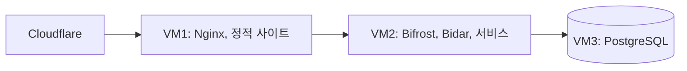

    

# BNGdrasil (BNbong + ygGdrasil)

**개인 클라우드 인프라 프로젝트**

*[bnbong](https://github.com/bnbong)의 개인 클라우드 인프라 프로젝트입니다*

---

## 소개

BNGdrasil은 개인 클라우드 인프라 프로젝트입니다. Wegis와 Overlock, ambiw 같은 개인 서비스를 한 인프라 위에서 운영합니다. 인증과 게이트웨이, 데이터베이스, 관측 도구를 모든 서비스가 공유합니다. 구성 요소는 독립된 저장소로 나뉘며, 이름은 북유럽 신화와 그리스 신화에서 따왔습니다.

## 프로젝트

| | 이름 | 역할 |
|---|---|---|
|  | [Bidar](https://github.com/BNGdrasil/Bidar) | 인증 서버 |
|  | [Bifrost](https://github.com/BNGdrasil/Bifrost) | API 게이트웨이 |
|  | [Bantheon](https://github.com/BNGdrasil/Bantheon) | 웹 클라이언트와 VM1 Nginx 설정 |
|  | [Baedalus](https://github.com/BNGdrasil/Baedalus) | 인프라 코드와 운영 도구 |
|  | [Bsgard](https://github.com/BNGdrasil/Bsgard) | 자체 VPC 네트워크 구상 (계획 단계) |

## 구조

외부 요청은 Cloudflare를 거쳐 VM1의 Nginx에 도착합니다. Nginx는 정적 사이트를 응답하고 API 요청은 VM2로 넘깁니다. VM2에서는 Bifrost와 Bidar, 개별 서비스가 동작합니다. 데이터는 사설 서브넷 VM3의 PostgreSQL에 저장합니다.

```mermaid
graph LR
    CF[Cloudflare] --> VM1[VM1: Nginx, 정적 사이트]
    VM1 --> VM2[VM2: Bifrost, Bidar, 서비스]
    VM2 --> VM3[(VM3: PostgreSQL)]
```

## 현재 상태

주요 서비스는 운영 중입니다. 2026년 9월부터 전면 보수를 진행하고 있습니다. 인증 강화와 게이트웨이 안정화, 백업과 관측과 CI/CD 정비가 보수의 범위입니다.

## 기술 스택

| 영역 | 사용 기술 |
|---|---|
| 백엔드 | Python 3.12, FastAPI, uv |
| 프런트엔드 | React, TypeScript, Vite |
| 인프라 | Terraform, Docker Compose, Nginx, Cloudflare |
| 데이터 | PostgreSQL, Redis |
| 관측 | Prometheus, Grafana, Loki |
